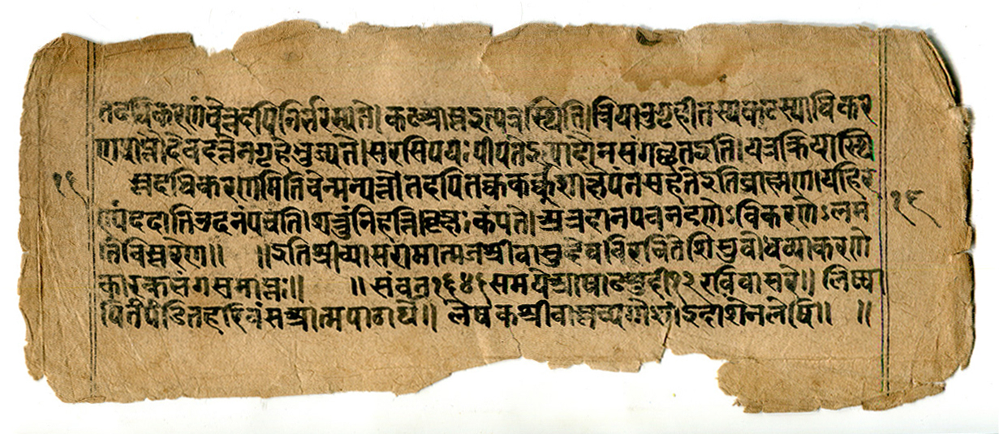
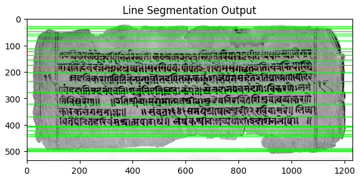

# Palm Leaf Manuscript Enhancement and Line Segmentation

Classical image processing pipeline for palm leaf manuscript enhancement and line segmentation using Python and OpenCV.

## Objectives
- Enhance manuscript readability
- Reduce background interference
- Improve binarization quality
- Perform text line segmentation

## Methodology

### 1. Image Preprocessing
- Grayscale conversion
- CLAHE contrast enhancement
- Bilateral filtering
- Background normalization

### 2. Binarization
- Gaussian smoothing
- Otsu thresholding
- Morphological operations

### 3. Line Segmentation
- Horizontal projection analysis
- Region detection
- Segmentation refinement

## Tools & Libraries
- Python
- OpenCV
- NumPy
- Matplotlib

## Key Insight
The project demonstrated that improving preprocessing and binarization quality had a greater impact on segmentation accuracy than modifying segmentation algorithms.

## Output
The pipeline enhances degraded manuscript images and enables projection-based line segmentation for computational manuscript analysis.

## Results

### Input Manuscript

### Segmentation Output

## Limitations
- Segmentation accuracy depends on manuscript image quality.
- Severe degradation and illumination variation may affect line detection.
- Highly noisy regions may produce merged segmentation outputs.

## Future Scope
- OCR integration
- Deep learning-based manuscript restoration
- AI-assisted document enhancement
- Computational manuscript transcription systems

## Author
Mabbu Ketan Prakash Reddy  
M.Sc Bioinformatics | SVIMS
